# 3.2 
   Abrimos una nueva terminal.
    
   docker ps, nos muestra los contenedores en ejecución. 
   Podemos apreciar que la última columna nos indica que el puerto 80 
   del contenedor está redireccionado a un puerto local 0.0.0.0.:PORT -> 80/tcp.
   
   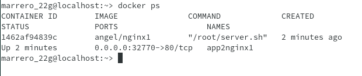 
    
   Abrir navegador web y poner URL 0.0.0.0.:PORT. 
   De esta forma nos conectaremos con el servidor 
   Nginx que se está ejecutando dentro del contenedor.
  
  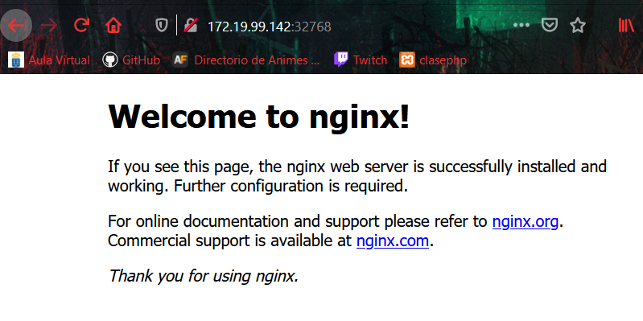 
  
  Comprobar el acceso a holamundo1.html.

  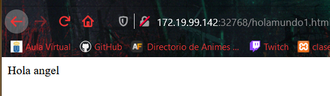 
   
  Paramos el contenedor app2nginx1 y lo eliminamos.
  
# 4.2
  
  El fichero Dockerfile contiene toda la información necesaria para construir el contenedor, veamos:

  cd dockerXXa, entramos al directorio con el Dockerfile.
    
  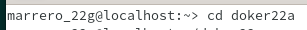 
    
  docker build -t nombre-alumno/nginx2 ., 
  construye una nueva imagen a partir del Dockerfile. 
  OJO: el punto final es necesario.
  
  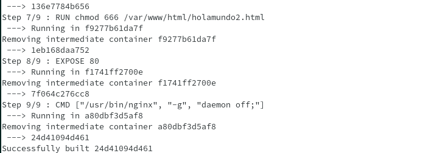 
  
  
  docker images, ahora debe aparecer nuestra nueva imagen.
  
  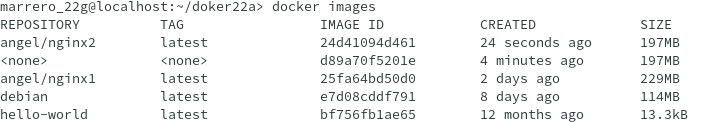 
  

# 4.3 

  A continuación vamos a crear un contenedor con el nombre app4nginx2, 
  a partir de la imagen nombre-alumno/nginx2. 
  Probaremos con:

docker run --name=app4nginx2 -p 8082:80 -t nombre-alumno/nginx2

 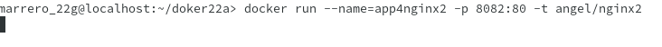 

Desde otra terminal:

 docker ps, para comprobar 
 que el contenedor está en ejecución y 
 en escucha por el puerto deseado.
 
  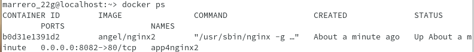 

    
 Comprobar en el navegador:
       
   URL http://localhost:PORTNUMBER
     
   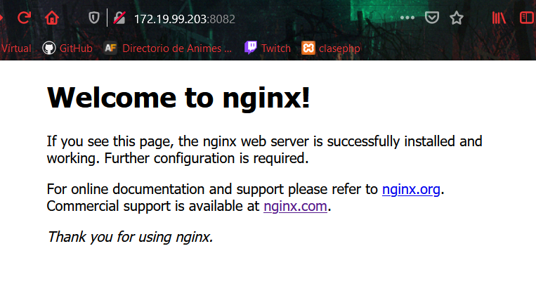 
     
   URL http://localhost:PORTNUMBER/holamundo2.html
     
   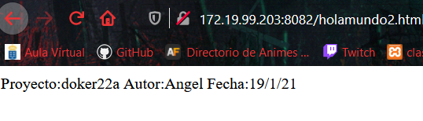
   

# 4.4

Crea el directorio dockerXXb. Entrar al directorio.

   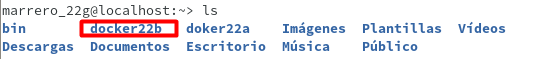

 Crear fichero holamundo3.html con:
       
   Proyecto: dockerXXb
   Autor: Nombre del alumno
   Fecha: Fecha actual
 
 Crea el siguiente Dockerfile

   FROM nginx

   COPY holamundo3.html /usr/share/nginx/html
   RUN chmod 666 /usr/share/nginx/html/holamundo3.html

   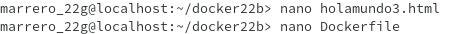
    
    
  Poner el el directorio dockerXXb los ficheros que se requieran para construir el contenedor.
  
   docker build -t nombre-alumno/nginx3 ., crear la imagen.
   
   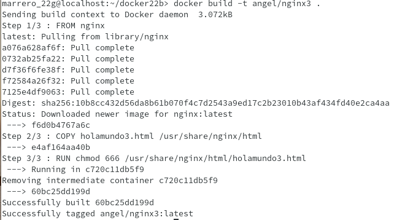
   
   docker run --name=app5nginx3 -d -p 8083:80 nombre-alumno/nginx3, crear contenedor.
   
   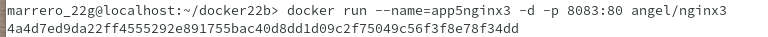
   
   Comprobar el acceso a "holamundo3.html".

   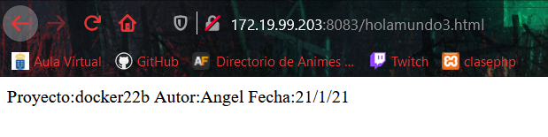
   
   
   

 
 
 

        
