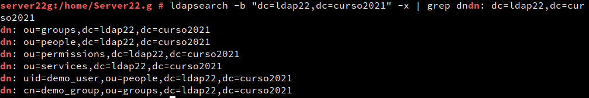
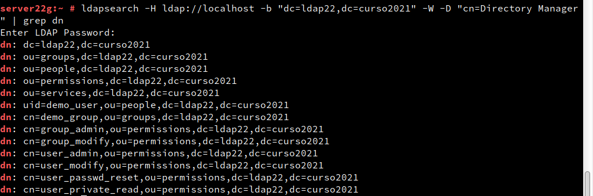
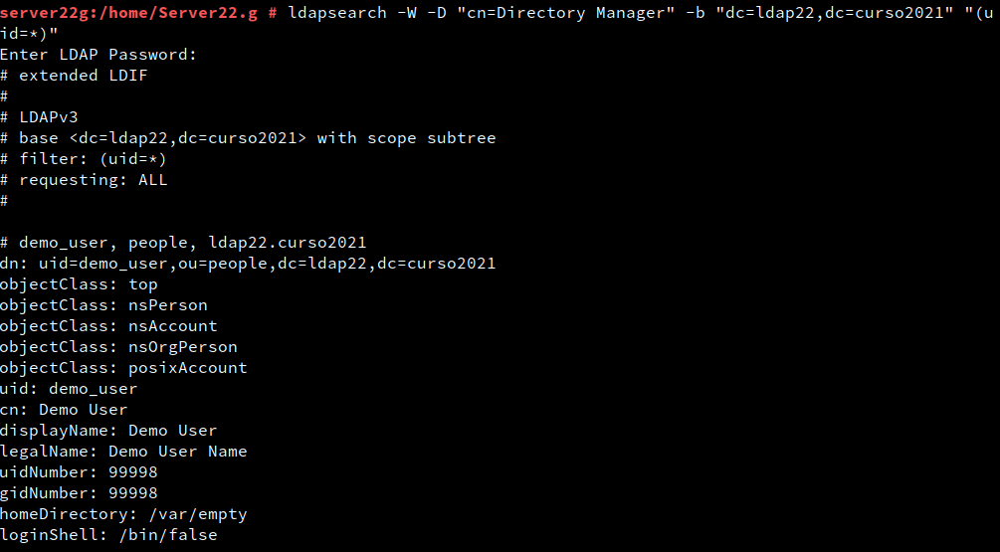
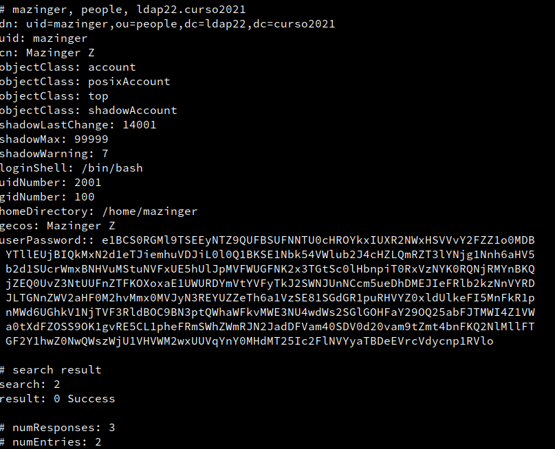
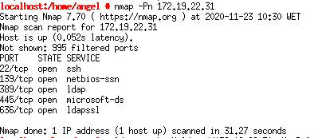
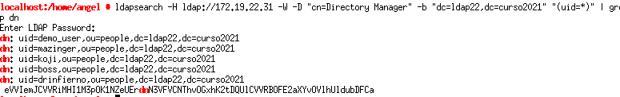

# PRACTICA DE LDAP

Los puntos de rubrica que hay que valorar son el 2.4, 3.3 y el 4.3

## 2.4 Comprobamos el acceso al contenido del LDAP 

ldapsearch -b "dc=ldapXX,dc=curso2021" -x | grep dn, muestra el contenido de nuestra base de datos LDAP. "dn" significa nombre distiguido,
es un identificador que tiene cada nodo dentro del árbol LDAP.

 

ldapsearch -H ldap://localhost -b "dc=ldapXX,dc=curso2021" -W -D "cn=Directory Manager" | grep dn, en este caso hacemos la consulta usando usuario/clave.

 

## 3.3 Comprobar el nuevo usuario

Estamos usando la clase posixAccount, para almacenar usuarios dentro de un directorio LDAP. Dicha clase posee el atributo uid. Por tanto, para listar los usuarios de un directorio, podemos filtrar por "(uid=*)".

    ldapsearch -W -D "cn=Directory Manager" -b "dc=ldapXX,dc=curso2021" "(uid=*)", para comprobar si se ha creado el usuario correctamente en el LDAP.
    

 

 

## 4.3 Comprobar los usuarios creados

Ir a la MV cliente LDAP.

nmap -Pn IP-LDAP-SERVER, comprobar que el puerto LDAP del servidor está abierto. Si no aparecen los puertos abiertos, entonces revisar el cortafuegos.

 

ldapsearch -H ldap://IP-LDAP-SERVER -W -D "cn=Directory Manager" -b "dc=ldapXX,dc=curso2021" "(uid=*)" | grep dn para consultar los usuarios LDAP que tenemos en el servicio de directorio remoto.

 

