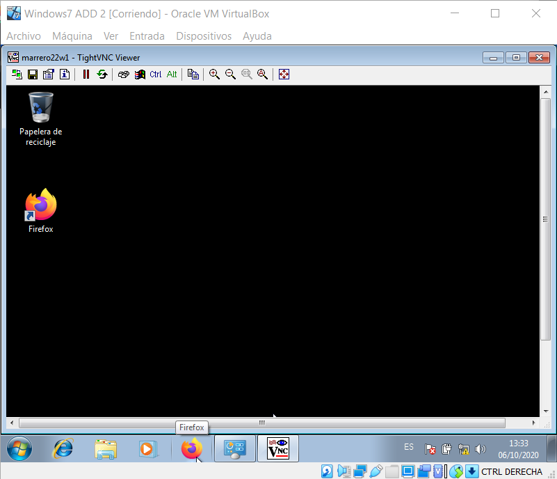

# Informe de VNC
Tras crear dos maquinas virtuales Windows 7, una para hacer de servido y otra para hacer de cliente. En la Cliente instale el TightVNC Viewer y en el Server solo la función servidor.

El servidor tiene la dirección IP 172.19.22.11. Añadí esa dirección IP en el DNS de la cliente y lo conecte al Windows servidor.

