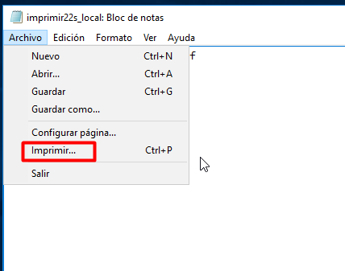
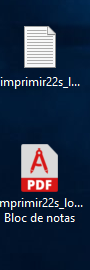
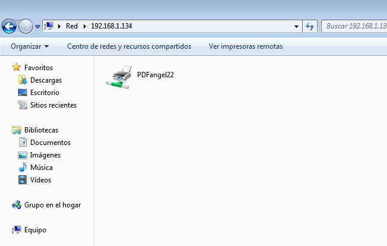
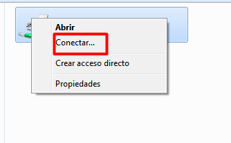
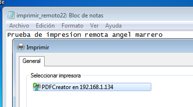
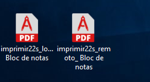
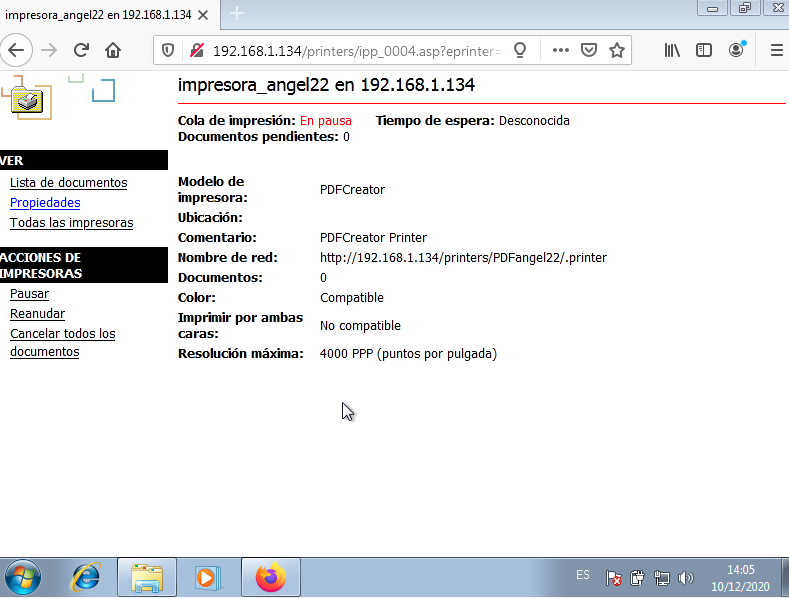
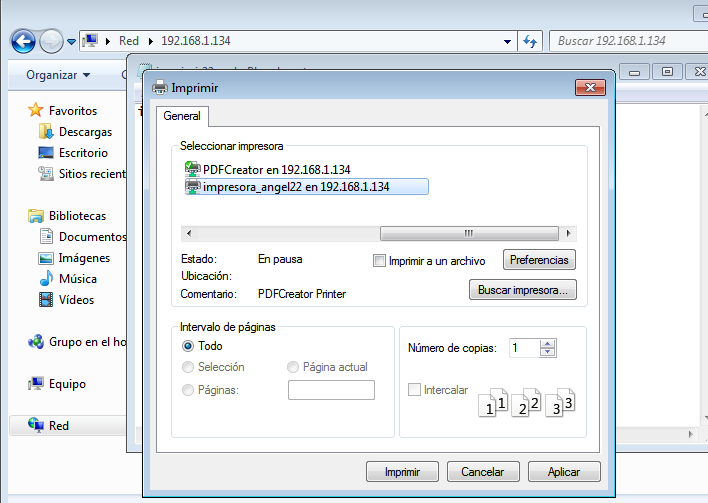
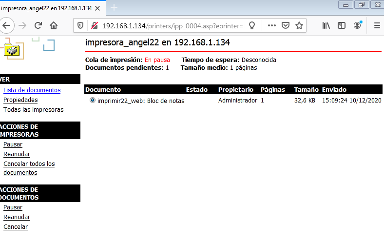
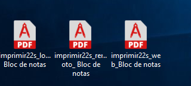

# Servidor de Impresión en Windows

## 1.3 Probar la impresora en local

Para crear un archivo PDF no hará falta que cambies la aplicación que estés usando, simplemente ve a la opción de imprimir y selecciona "Impresora PDF", en segundos tendrás creado tu archivo PDF.

Puedes probar la nueva impresora abriendo el Bloc de notas y creando un fichero luego selecciona imprimir. Cuando finalice el proceso se abrirá un fichero PDF con el resultado de la impresión.

    Probar la impresora remota imprimiendo documento imprimirXXs-local.

## 2.2 Comprobar desde el cliente

Vamos al cliente:

    Buscar recursos de red del servidor. Si tarda en aparecer ponemos \\ip-del-servidor en la barra de navegación.
    Seleccionar impresora -> botón derecho -> conectar.
     
   
   
   

    
    
        Ponemos usuario/clave del Windows Server.
    Ya tenemos la impresora remota configurada en el cliente.
    
  
    
    
    Probar la impresora remota imprimiendo documento imprimirXXw-remoto.

 

## 3.3 Comprobar desde el navegador

    
Vamos a realizar seguidamente una prueba sencilla en tu impresora de red:

    Accede a la configuración de la impresora a través del navegador. 
      Poner en pausa los trabajos de impresión de la impresora.
  
    Ir a MV cliente.
    Probar la impresora remota imprimiendo documento imprimirXXw-web.
    

        Comprobar que al estar la impresora en pausa, el trabajo aparece en cola de impresión.
        
         
    Finalmente pulsa en reanudar el trabajo para que tu documento se convierta a PDF.
    
 
   
   
   
   Si tenemos problemas para que aparezca el PDF en el servidor, iniciar el programa PDFCreator y esperar un poco.
