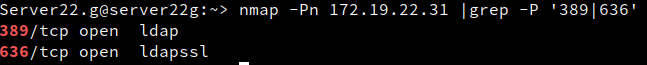
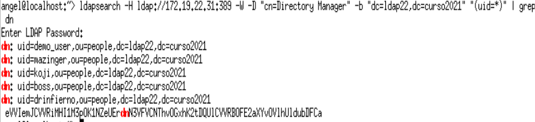
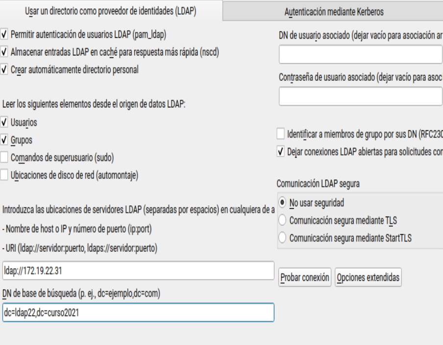
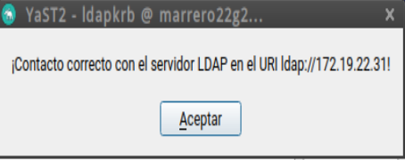

# LDAP-389-ds

## 1. Preparativos

Primero comprobamos la conección entre el servidor ldap y el cliente con los comandos
nmap -Pn IP-LDAP-SERVERXX | grep -P '389|636'

para comprobar que el servidor LDAP es accesible desde la MV2 cliente.

ldapsearch -H ldap://IP-LDAP-SERVERXX:389 -W -D "cn=Directory Manager" -b "dc=ldapXX,dc=curso2021" "(uid=*)" | grep dn

comprobamos que los usuarios del LDAP remoto son visibles en el cliente.

# 2. Configurar autenticación LDAP

    Ir a la MV cliente.
    No aseguramos de tener bien el nombre del equipo y nombre de dominio (/etc/hostname, /etc/hosts)
    Ir a Yast -> Cliente LDAP y Kerberos.
    Configurar como la imagen de ejemplo:
        BaseDN: dc=ldapXX,dc=curso2021
        DN de usuario: cn=Directory Manager
        Contraseña: CLAVE del usuario cn=Directory Manager
        

 
Al final usar la opción de Probar conexión

